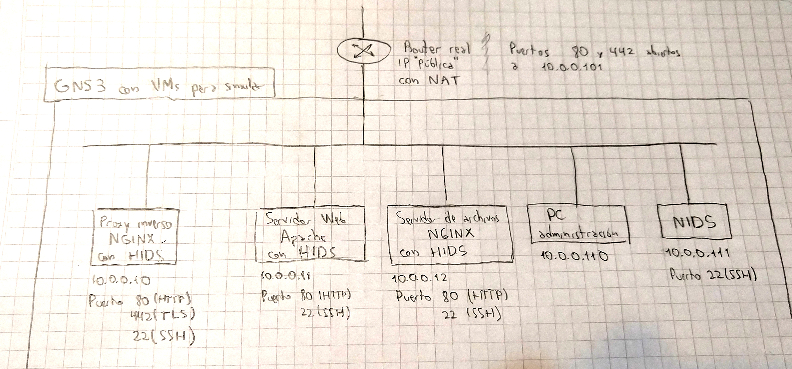

# proxy_ids

trabajo final de redes de informacion

## Varios

- Nombre empresa: `teleconet`.
- Dirección empresa: `teleconet.mbernardi.com.ar`.

## Consigna 1

Implementación de un grupo de servidores para una empresa, que consista de
diferentes servidores ubicados en diferentes máquinas

- Un proxy reverso con seguridad (HTTPS).

- Un servidor web para una página web estática.

- Un servidor de archivos simple HTTP (solamente descargas o puede que de subida
  también).

- Sistema de detección de intrusos HIDS, uno en cada máquina

- Sistema de detección de intrusos NIDS para la red.

Sobre detección de intrusos estuvimos viendo que existe por ejemplo fail2ban,
OSSEC y Suricata, no sabemos bien de que se tratan o qué dificultad tienen pero
nos parece interesante el tema.

## Consigna 2

Este es el diagrama de red que vamos a implementar en un principio. Para hacer
fácil las simulaciones vamos a intentar hacer todo dentro de GNS3 usando
máquinas virtuales.



Es una simulación de la red de una empresa pequeña, entonces usaríamos un router
común, que tenga NAT y una "IP pública". Ese router tendría abiertos los puertos
80 y 442 que apunten al proxy inverso. A diferencia del router, las máquinas van
a ser virtuales y van a estar todas en la misma red. Los dos servidores web se
acceden a través del proxy inverso.

Eso es lo que tenemos pensado hacer relativo a los servicios web, que es lo
primero que vamos a implementar, después tenemos pensado implementar HIDS y
NIDS.

En principio pensamos usar como HIDS a fail2ban, entonces dentro de cada
servidor debería haber un fail2ban que monitoree los logs y que notifique al
administrador cuando haya algo sospechoso. Por lo menos queremos detectar cuando
alguien está haciendo algún tipo de escaneo en el sitio web. Si vemos que vale
la pena podríamos usar a OSSEC que parece más completo en lugar de fail2ban.

En una máquina aparte habría un NIDS como por ejemplo Snort que snifee la red
también buscando algo sospechoso para notificar al administrador.

No estamos seguros todavía de hasta donde llegar con lo de HIDS y NIDS, porque
primero tenemos que investigar de qué se tratan, en qué ayudan, y si tiene
sentido implementarlos en una red como la propuesta.

## Comandos docker sin GNS3

### Ejecutar un docker

```
cd python-prueba
docker build -t python-prueba .
docker run -it -p 8080:8080 python-prueba
```

Para volver a correr son los mismos comandos

## Configuraciones GNS3

### Configuración inicial

#### R1

Esto se hizo dentro de una consola del Router, pero no se debe hacer nunca más.
```
ip address add interface=ether2 address=10.0.0.1/24
```

#### Máquinas

Esto se corre en tu PC.

```
cd docker
docker build -t reverse_proxy ./reverse_proxy
docker build -t servidor_web ./servidor_web
docker build -t servidor_archivos ./servidor_archivos
docker build -t snort_nids ./docker/snort_nids
```

Después dentro de GNS3 hay que importar esos Dockers y darles IPs haciendo click
derecho y yendo a "Edit config".

### Modificación

Si se modifica algún Dockerfile, hay que volver a hacer build. Después en GNS3
se duplica la máquina modificada y se borra la anterior, de esa forma estamos
creando una máquina nueva que tiene la nueva build de Docker pero que además
mantiene las configuraciones de red hechas en "Edit config".

### Comando openssl

```
openssl req -x509 -sha256 -newkey rsa:4096 -nodes -keyout teleconet.mbernardi.com.ar.key -out teleconet.mbernardi.com.ar.crt -days 365 -subj "/CN=AR/ST=Cordoba/L=Rio Cuarto/O=teleconet/OU=tn/CN=teleconet.mbernadi.com.ar"
```

- req es de request
- -sha256 es el modo que usa para crear el hash, este de 256 bits.
- -newkey rsa:xxxx indica que crea una nueva key con tamaño rsa. Si ya tenes una key podes generar el certificado directamente con openssl req -key domain.key -new -out domain.csr
- -nodes es para que no tengas que darle una contraseña
- -keyout el nombre que va a tener la clave que generas
- -out el nombre del certificado a la salida
- -days la duración de validez del certificado
- -subj es para darle lo que necesitas para crear el certificado (pais, provincia, ciudad, empresa,etc)

## SNORT

Para las configuraciones partimos de lo que venía en `/etc/snort/` en Fedora, no
había ninguna regla.

### Reglas

```
<rule action> <protocol> [!]<source ip> [!]<source port> <direction> <dest ip> <dest port> <rule options> (aca van otras cosas que son las que ejecuta)
```
  
  rule action puede ser:
  - alert: manda una alerta al administrador
  - log: es una segunda opcion, cuando no queres mandar una alerta pero queres dejar registrado un evento en especial
  - pass: en un lado lei que hace drop y en otro que deja pasar derecho, creo que tiene mas sentido la segunda
  - activate: si ocurre, se activan otras reglas
  
  protocol (TCP, UDP, ICMP para el ping)
  
  source ip, source port, dest ip y dest port: es transparente. Si le pones el signo de exclamacion (!) adelante invierte la regla. Si queres un rango de puertos por ejemplo le pones como 1:10. Si queres cualquier ip o puerto le pones "any". Para la ip se le puede poner 192.168.0.1/24
  
  Para el caso que en el campo de source ip, podes definir variables como listas o solo una ip en el archivo snort.conf y despues cuando creas la regla en el archivo .rules le pones $Nombre_variable que creaste.
  
  direction va "->". Eso significa que ves lo que vaya de la "source ip source port" a "dest ip dest port" 
  
  Entre paréntesis indicás lo que queres hacer con la regla por ejemplo si tenes (msg: "SCAN SYN FIN"; flow:stateless ; flags: SF,12 ; reference: ; classtype: ; sid: ; rev: )
  
  - msg: es lo que envias al admin cuando ocurre la regla
  - flow: established (TCP established), not established (no TCP connection established), stateless (either established or not established)
  - flags: en el caso de tcp puede ser de tipo SYN, FIN, PSH, URG, RST, or ACK. En el caso de ejemplo como quiere los de SYN y FIN pone SF y el 12 es notacion vieja, significa que ignoras eso. Ahora se usa por ejemplo CE en vez del doce que indica que ignora CWR (bit 1 reservado) y ECN (bit 2 reservado)
  - reference: sirve para obtener mas info de los ataques, porque te manda a una pagina que vos pongas ahi donde se encuentra el IDS del ataque.
  - classtype: es como que ya te vas al pasto, por que es como que estableces el tipo de ataque y la prioridad que hay de 1 a 4.
  - sid y rev se utilizan para identificar el numero de la regla.
