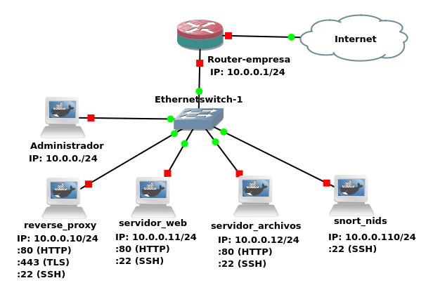

Problemática
============

Se planteó el problema de administrar la red de una empresa pequeña y crear un
servidor web para la página principal de la empresa y otro en donde se
encuentran archivos disponibles para la descarga. Al contar solo con una salida
a internet, es necesario el uso de alguna herramienta que permita tener varios
servidores en una misma dirección IP. A esto se lo conoce como proxy inverso,
una herramienta que permite redireccionar solicitudes dependiendo el destino que
tengan estas consultas. Para mayor seguridad, fue solicitado la instalación de
un servidor de detección de intrusos, que registre cualquier tipo de evento no
autorizado dentro de la red. La red a implementar es la siguiente:


Es importante tener en cuenta que se considera que la implementación se
realizará en una empresa pequeña, por lo tanto lo más probable es que no haya un
administrador disponible todo el tiempo para garantizar el correcto
funcionamiento de la red.

Suponiendo que el administrador sólo está disponible unas pocas horas semanales,
es importante disponer de software de monitoreo que registre el estado de la red
y detecte comportamientos unusuales ya sea para notificar al administrador
inmediatamente para registrar los eventos para su posterior análisis.

Implementación
==============

Servidor Web y Archivos
=======================
Para la implementación del servidor de la página principal de la empresa se hizo uso de la herramienta NGINX 
Está compuesto por dos archivos:
- **Archivo de configuración de nginx**: Este se encarga de configurar nginx de forma tal que sepa en qué carpeta brindar el servicio y el puerto a escuchar.
- **Página html**: Contiene los archivos html, css y las imágenes de la página.

El servidor de archivos es similar, con la diferencia de que no creamos una página html, sino que creamos una carpeta con los archivos a servir de la empresa. También se utilizó un módulo dentro del archivo de configuración de nginx llamado _auto-index_. Este procesa las peticiones que terminan con el caracter ('/') y produce una lista de directorios.

Sin embargo, el servidor web y archivos se encuentran separados en distintos servidores, es decir, como distintos hosts dentro de la empresa, de forma tal que el proxy reverso se encargue de redirigir el tráfico al correspondiente.

La configuración del archivo de la página a brindar en nginx es bastante simple, a continuación se muestra la del servidor
de archivos:

```
server {
    listen 80; # puerto (ip es opcional)
    location / { 
        root /var/www/; # carpeta desde donde empezar a buscar
    }
}
```
HTML Y CSS
----------
HTML (Hyper Text Markup Language) es el lenguaje estándar de marcado en el diseño de páginas web. Un lenguaje de marcado o marcas es uno en el cual el texto va acompañado de marcas o etiquetas que contienen información adicional sobre la estructura del documento. CSS (Cascading Style Sheets) describe el formato de presentación de una página html. Sirve para ahorrar trabajo cuando se tienen varias páginas web a servir. La forma más común de implementación es crear los estilos de los elementos html en un archivo externo y después importarlo en el documento.

El diseño de la página se realizó en HTML5 y en CSS desde cero. Existen varias modificaciones en esta versión de HTML como la incorporación de soporte nativo para JavaScript, cambios en la semántica de la estructura del documento, etc.


En la página principal, al clickear el botón de "Descargas", automáticamente es redireccionado al servidor de archivos que se encuentra en otro host por el proxy reverso. 

Reverse Proxy
=============
El proxy inverso es un servidor que es capaz de manejar multiples servidores, por ejemplo web, php o python, y dividir las peticiones para cada uno de ellos individualmente. Por ejemplo, cuando un cliente desea ingresar a alguno de los servidores administrados por este proxy inverso, este redirecciona la petición al servidor indicado y devuelve al cliente lo solicitado. Una gran ventaja de esto es la posibilidad de tener múltiples servidores en una misma dirección IP.
Para este trabajo se desarrolló un proxy inverso, que administra los servidores ya mencionados anteriormente, mediante la herramienta NGINX. El servidor proxy inverso se realizó de la siguiente manera:

```
server {
	listen 80;
	server_name teleconet.mbernardi.com.ar;

	location / {
		proxy_pass http://10.0.0.11:80/;
	}
	location /archivos {
		proxy_pass http://10.0.0.12:80/;
	}
}

```
En esta parte del código de nginx se puede ver como se crea el servidor. Debido a que los servidores son solo http, el proxy inverso escucha en el puerto 80 y redirecciona de acuerdo a si la petición fue para la página principal o los archivos haciendo un proxy_pass a la IP indicada o bien puede ser a un dominio determinado en caso que exista un dns.

HTTPS
-----
Debido a que http es poco seguro, utilizamos https para darle mayor seguridad a nuestra red. Es decir, que las peticiones que se hacen a los servidores http en realidad estan cifradras en https hasta que llegan al servidor proxy y este se encarga de interpretar. Para ello es necesario crear un certificado que generen la clave de cifrado que permita encriptar la información. A su vez, también es necesario que el servidor no solo trabaje en el puerto 80 de http, sino que también utilice el puerto 443 que es de https.
Para lograr que el servidor maneje https dentro del código en nginx se debe agregar:
```
	listen 443 ssl;
	ssl_certificate teleconet.mbernardi.com.ar.crt;
	ssl_certificate_key teleconet.mbernardi.com.ar.key;
	ssl_protocols TLSv1 TLSv1.1 TLSv1.2;

	ssl_ciphers 'ECDHE-ECDSA-AES256-GCM-SHA384:ECDHE-RSA-AES256-GCM-SHA384:ECDHE-ECDSA-CHACHA20-POLY1305:ECDHE-RSA-CHACHA20-POLY1305:ECDHE-ECDSA-AES128-GCM-SHA256:ECDHE-RSA-AES128-GCM-SHA256:ECDHE-ECDSA-AES256-SHA384:ECDHE-RSA-AES256-SHA384:ECDHE-ECDSA-AES128-SHA256:ECDHE-RSA-AES128-SHA256';

	ssl_prefer_server_ciphers on;
```

En nuestro caso, generamos un certificado firmado por nosotros con el nombre de la companía, lo cual no es lo óptimo ya que para un usuario externo a la red, no existe forma de comprobar la validez del certificado y que realmente somos nosotros los creadores y dueños de la página. La única forma mediante la cual puede estar seguro es si se le proporciona el certificado por otro medio que no sea por internet, por ejemplo por usb en forma presencial. Para poder generarlo se utilizó el comanto openssl req. Para evitar esto, a modo de mejora se podría crear un certificado con alguna certificadora confiable, por ejemplo lets encrypt la cual permite generar certificados gratuitos y confiables para cualquier usuario.

Snort NIDS
==========

Snort es un servidor sniffer que se puede utilizar de varias formas:

- Sniffer mode: Lee paquetes presentes en la red y los muestra en la consola,
  similar a Wireshark.

- Packet logger mode: Lee paquetes presentes en la red y los guarda en un
  archivo.

- Network Intrusion Detection System (NIDS) mode: Lee paquetes presentes en la
  red y los analiza para determinar si es necesario realizar una acción. Puede
  trabajar en modo pasivo o Inline:

    - Pasivo: Es lo que utilizamos, analiza el tráfico para observar paquetes
      sospechosos y advertir al administrador.

    - Inline: Se coloca el servidor Snort de forma que éste pueda bloquear
      tráfico dependiendo de los patrones observados, como si se tratase de un
      firewall.

Nosotros utilizamos y recomendamos el modo Pasivo, al menos en un principio ya
que Snort necesita mucho cuidado, un gran mantenimiento y mucho trabajo. Un
pequeño error de configuración, o una falla en el servidor por otras causas
dejaría fuera de línea al sitio web de la empresa.

El servidor Snort es usado sólo para alertar sobre comportamientos sospechosos a
partir de las reglas escritas en los archivos de configuración. De esta forma el
administrador es notificado de estas alertas cuando vuelve al trabajo.

Algunas de las alertas que consideramos importantes en una primera instancia
son:

- Que ya se ha comprometido un servidor dentro de la red, por ejemplo si uno de
  los servidores está originando tráfico que normalmente no produce, o si hay
  tráfico desde y hacia una IP local que no se corresponde a ninguno de los
  servidores conocidos.

- Que indique que desde fuera se está realizando un escaneo de la red, por
  ejemplo si hay muchas solicitudes simultáneas, o si están accediendo a muchas
  TODO.

- Que indique algunas cosas que no deberían suceder, por ejemplo tráfico SSH
  desde alguna máquina que no sea la del administrador.

Hay que tener en cuenta que el router de la empresa ya funciona como un firewall
básico y no debería haber tráfico entrante que no sea por los puertos 80 y 443.
Además, al utilizar port forwarding este tráfico va dirigido exclusivamente al
proxy.

En el anexo hay listadas algunas reglas básicas que pueden utilizarse para
detectar este tipo de comportamientos en la red, las reglas se ecriben en un
archivo de texto que normalmente está ubicado en `/etc/snort/rules/local.rules`

Un ejemplo de regla que genera alertas para tráfico proveniente de la red local
destinado a un servidor web sería:

```
alert tcp 10.0.0.0/24 any -> 10.0.0.10 80 ( \
    msg:"Tráfico desde red local hacia 10.0.0.10:80";
    sid:1000801; \
    rev:1;)
```

La sintaxis de cada regla incluye:

- Acción a realizar, en nuestro caso usamos `alert` para almacenar el evento en
  `/var/log/snort/alerts`.

- Protocolo, puede ser `tcp`, `udp` o `icmp`.

- IP o red de origen, puede ser una red o `any`.

- Puerto de origen, puede ser `any`.

- IP o red de destino, puede ser una red o `any`.

- Puerto de destino, puede ser `any`.

- Luego entre paréntesis se colocan las opciones, algunas de ellas son:

    - msg: Descripción de la alerta generada.

    - sid: Número que identifica a la alerta.

    - rev: Número que identifica a la revisión de la alerta, en el caso que ésta
      haya sido modificada.

    - flags: En el caso de TCP permite especificar flags presentes en el
      paquete.

    - content: Realiza una búsqueda en el contenido del paquete, puede realizar
      búsqueda de texto o de datos binarios. En el caso de HTTP se pueden usar
      algunas opciones que permiten restringir la búsqueda al header, uri,
      cuerpo, etc.

Por ejemplo las conexiones SSH se deberían originar normalmente sólo desde la PC
del administrador, puede ser útil generar alertas para intentos de conexiones
desde IPs diferentes a la utilizada por la PC del administrador:

```
alert tcp !10.0.0.112 any -> any 22 ( \
    msg:"Conexion SSH desde host distinto al del administrador"; \
    flags:S; \
    sid:1000101; \
    rev:1;)
```

Existen disponibles gran cantidad de reglas creadas por la comunidad de usuarios
en el sitio oficial de Snort.

Arquitectura
------------

El router tiene una IP pública y fija para permitir la configuración de un
dominio en un servidor DNS. Por lo tanto la lista de requerimientos es:

- Recomendamos obtener un dominio `.com.ar`, actualmente el costo es de $270, la
  renovación tiene el mismo costo y debe realizarse una vez al año.

- Se debe delegar el dominio a un servidor DNS, cuyo costo mínimo comienza a
  partir de los 20USD. Luego se debe configurar el servidor DNS para que apunte
  a la IP pública de la empresa.

Se debe usar un Hub pero recomendamos utilizar un switch que permita mostrar
todo el tráfico de la red en una de sus bocas para conectar ahí el servidor de
Snort.

Por ejemplo para monitorear el tráfico de todas las interfaces en el puerto
gigabitEthernet 1/1 se deben utilizar los comandos:

```
Switch>enable
Switch#configure terminal

Switch(config)#monitor session 1 source interface gigabitEthernet 0/0
Switch(config)#monitor session 1 source interface gigabitEthernet 0/1
Switch(config)#monitor session 1 source interface gigabitEthernet 0/2
...

Switch(config)#monitor session 1 destination interface gigabitEthernet 1/1
```

https://www.cisco.com/c/en/us/support/docs/switches/catalyst-6500-series-switches/10570-41.html

http://manual-snort-org.s3-website-us-east-1.amazonaws.com/

Simulación
===========
Debido a la imposibilidad de implementarlo físicamente por el momento, se realizó una simulación de la arquitectura de la red en el programa GNS3, lo cual permitió observar el funcionamiento de la misma. Para cada uno de los servidores presentes en la red se utilizó la herramienta de Docker, que genera un contenedor a partir de un archivo *Dockerfile* que contiene los pasos necesarios para el correcto funcionamiento, como por ejemplo la instalación de nginx, comandos para ejecutar el servidor y copia de archivos necesarios.



Conclusión
==========

Bajo la experiencia y los resultados obtenidos, se determinó factible la
implementación de hosteo de varios servidores en la red de una empresa mediante
la utilización de un proxy reverso, sumándole seguridad de red con NIDS. El
proxy reverso permite mayor transparencia al usuario final y para el administrador
de la red simplifica la redirección de peticiones HTTP al host deseado. NIDS nos
pareció una herramienta útil de detección de intrusos y control de red. Permite al
encargado de la red estar al tanto del estado de la red y que no esté ocurriendo 
nada fuera de lo normal. A modo futuro, se propone profundizar en la seguridad de
la red, agregando una interfaz gráfica al NIDS, para facilitar el monitoreo de la
red, colocar HIDS en cada uno de los hosts de la red, e implementar un firewall.
